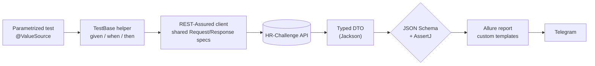

<h1 align="center">REST API Test Framework</h1>

<p align="center">
  A production-style REST API automation suite — <b>contract-validated</b>, <b>data-driven</b>,
  and <b>fully reported</b>. Engineered on a current JVM stack.
</p>

<p align="center">
  
  
  
  
  
  
  
</p>

<p align="center">
&nbsp;&nbsp;
&nbsp;&nbsp;
&nbsp;&nbsp;
&nbsp;&nbsp;
&nbsp;&nbsp;
&nbsp;&nbsp;
&nbsp;&nbsp;

</p>

---

## Highlights

- **Contract-first validation** — every response is checked against a **JSON Schema**, so structural drift fails the test before a single field assertion runs.
- **Data-driven by design** — parametrized tests fan out positive *and* negative scenarios from compact `@ValueSource` sets: valid IDs, missing IDs, non-existent IDs, special characters, invalid/blank gender.
- **Build specs once, reuse everywhere** — request/response `Specification`s are assembled a single time in `@BeforeAll`; tests stay declarative.
- **One call, zero duplication** — the `given/when/then` pipeline lives in reusable generic `TestBase` helpers (`getUserById`, `getUser`, `getUsersByGender`), so each test is ~4 lines of intent.
- **Reports that read themselves** — custom Allure Freemarker templates render each exchange as a request/response card with a copy-ready **cURL**.
- **Parallel-ready** — runs on the JUnit Platform with configurable fixed parallelism.
- **Self-provisioning build** — the Gradle wrapper + **foojay** toolchain resolver fetch the right JDK automatically; clone and run.
- **Results in your pocket** — Allure summaries delivered to **Telegram**.

## Architecture



## Tech Stack

| Layer | Tool | Why it's here |
|---|---|---|
| Language | **Java 25 (LTS)** | Current LTS; modern language baseline |
| Build | **Gradle 9.6.0** + wrapper + foojay | Reproducible builds; auto-provisions the JDK |
| Test engine | **JUnit 6** | Parametrized, data-driven, parallel execution |
| HTTP & validation | **REST-Assured 6** | Fluent request building + JSON Schema validation |
| Assertions | **AssertJ 3.27** | Readable, chainable assertions |
| Reporting | **Allure 2.35** | Step-level reports, behaviors, custom templates |
| Mapping | **Jackson** | Response → typed DTOs |
| Notifications | **Telegram** | Report delivery to chat |
| CI | **Jenkins** | Triggered / scheduled runs |

## Project Structure

```
src/test/
├── java/
│   ├── tests/        # TestBase (shared specs + request helpers) + GetUser / GetAllUsers suites
│   ├── models/       # response DTOs: GetUserResponse, GetUserListResponse, CommonResponseError
│   └── listeners/    # CustomAllureListener — request/response Allure templates
└── resources/
    ├── schemas/      # JSON Schema (schemaV3.json) — the response contract
    └── tpl/          # Freemarker templates powering the Allure cards
notifications/        # Allure → Telegram delivery (jar + config)
```

## Test Design

| Endpoint | Positive | Negative |
|---|---|---|
| `GET /api/test/user/{id}` | valid male / female / any IDs | missing ID · non-existent ID · special characters |
| `GET /api/test/users?gender=` | valid genders | invalid gender · blank · missing parameter |

Every case validates the body against `schemas/schemaV3.json` and asserts the
business fields with AssertJ.

## Getting Started

```bash
# Run the whole suite (Gradle is pinned by the wrapper; the JDK is auto-provisioned)
./gradlew clean test

# Run a single suite
./gradlew test --tests "tests.GetUserTests"

# Run in parallel (N threads)
./gradlew clean test -Dthreads=4
```

> No local Gradle needed — the wrapper pins **9.6.0**. The **foojay** resolver
> provisions **JDK 25** if it isn't already installed.

## Reporting

```bash
./gradlew allureServe
```

Or launch from the IDE:


**Overview & behaviors**


**Custom request/response template (with cURL)**


## Telegram Notifications

Deliver the Allure summary to a chat via
[allure-notifications](https://github.com/qa-guru/allure-notifications):

```bash
java -jar notifications/allure-notifications-4.2.1.jar -c notifications/telegram_config.json
```

Provide your bot **token** and **chat id** in `notifications/telegram_config.json`.
> Keep real credentials out of version control.

## API Documentation

Swagger UI: [hr-challenge.interactivestandard.com](https://hr-challenge.interactivestandard.com/v3/swagger-ui/index.html?configUrl=%2Fv3%2Fapi-docs%2Fswagger-config&urls.primaryName=QA#/qa-test-controller)

## Continuous Integration

Jenkins: [build](https://jenkins.autotests.cloud/job/interactive-api-tests/4/) · [allure report](https://jenkins.autotests.cloud/job/interactive-api-tests/4/allure/)


