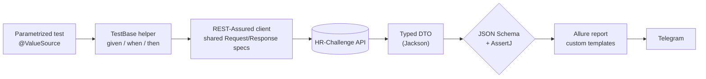

<h1 align="center">REST API Test Framework</h1>

<p align="center">
  API tests for the HR-Challenge REST API. Responses are validated against a JSON Schema, the cases are data-driven, and runs are reported with Allure.
</p>

<p align="center">
  
  
  
  
  
  
  
</p>

<p align="center">
&nbsp;&nbsp;
&nbsp;&nbsp;
&nbsp;&nbsp;
&nbsp;&nbsp;
&nbsp;&nbsp;
&nbsp;&nbsp;
&nbsp;&nbsp;

</p>

---

## What it does

- Every response is validated against a JSON Schema (`schemas/schemaV3.json`) before any field assertion runs, so structural drift fails the test early.
- Parametrized tests cover positive and negative cases from `@ValueSource` sets: valid IDs, missing IDs, non-existent IDs, special characters, invalid and blank gender.
- Request/response `Specification`s are built once in `@BeforeAll`, so the tests stay short.
- The `given/when/then` calls live in reusable `TestBase` helpers (`getUserById`, `getUser`, `getUsersByGender`), so each test is about four lines.
- Custom Allure Freemarker templates render each exchange as a request/response card with a copy-ready cURL.
- Runs on the JUnit Platform with configurable parallelism.
- The Gradle wrapper plus the foojay toolchain resolver fetch the right JDK automatically.
- Allure summaries are posted to Telegram.

## Architecture



## Tech stack

| Layer | Tool |
|---|---|
| Language | Java 25 (LTS) |
| Build | Gradle 9.6.0 (wrapper) + foojay |
| Test engine | JUnit 6 |
| HTTP & validation | REST-Assured 6 (JSON Schema validation) |
| Assertions | AssertJ 3.27 |
| Reporting | Allure 2.35 |
| Mapping | Jackson (response to DTOs) |
| Notifications | Telegram |
| CI | Jenkins |

## Project structure

```
src/test/
├── java/
│   ├── tests/        # TestBase (shared specs + request helpers) + GetUser / GetAllUsers suites
│   ├── models/       # response DTOs: GetUserResponse, GetUserListResponse, CommonResponseError
│   └── listeners/    # CustomAllureListener: request/response Allure templates
└── resources/
    ├── schemas/      # JSON Schema (schemaV3.json): the response contract
    └── tpl/          # Freemarker templates powering the Allure cards
notifications/        # Allure to Telegram delivery (jar + config)
```

## Test design

| Endpoint | Positive | Negative |
|---|---|---|
| `GET /api/test/user/{id}` | valid male / female / any IDs | missing ID · non-existent ID · special characters |
| `GET /api/test/users?gender=` | valid genders | invalid gender · blank · missing parameter |

Every case validates the body against `schemas/schemaV3.json` and asserts the
business fields with AssertJ.

## Getting started

```bash
# Run the whole suite (Gradle is pinned by the wrapper; the JDK is auto-provisioned)
./gradlew clean test

# Run a single suite
./gradlew test --tests "tests.GetUserTests"

# Run in parallel (N threads)
./gradlew clean test -Dthreads=4
```

> No local Gradle needed; the wrapper pins **9.6.0**, and the **foojay** resolver
> provisions **JDK 25** if it isn't already installed.

## Reporting

```bash
./gradlew allureServe
```

Or launch from the IDE:


**Overview & behaviors**


**Custom request/response template (with cURL)**


## Telegram notifications

Deliver the Allure summary to a chat via
[allure-notifications](https://github.com/qa-guru/allure-notifications):

```bash
java -jar notifications/allure-notifications-4.2.1.jar -c notifications/telegram_config.json
```

Provide your bot **token** and **chat id** in `notifications/telegram_config.json`.
> Keep real credentials out of version control.

## API Documentation

Swagger UI: [hr-challenge.interactivestandard.com](https://hr-challenge.interactivestandard.com/v3/swagger-ui/index.html?configUrl=%2Fv3%2Fapi-docs%2Fswagger-config&urls.primaryName=QA#/qa-test-controller)

## Continuous Integration

Jenkins: [build](https://jenkins.autotests.cloud/job/interactive-api-tests/4/) · [allure report](https://jenkins.autotests.cloud/job/interactive-api-tests/4/allure/)


