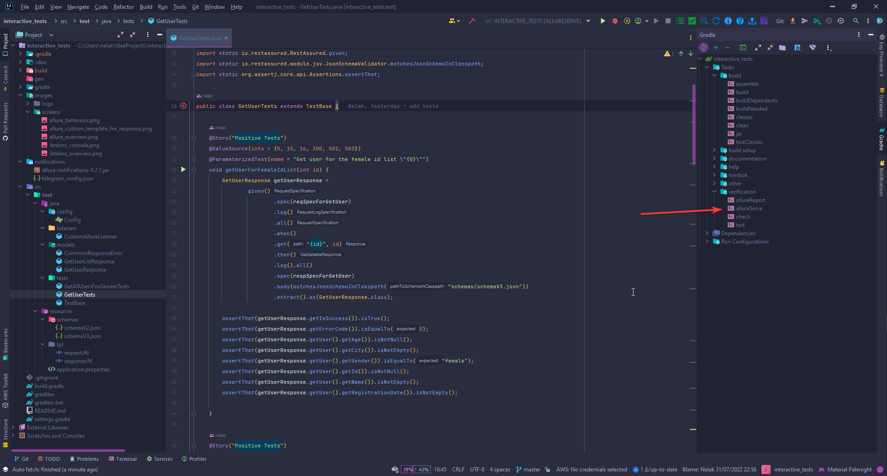
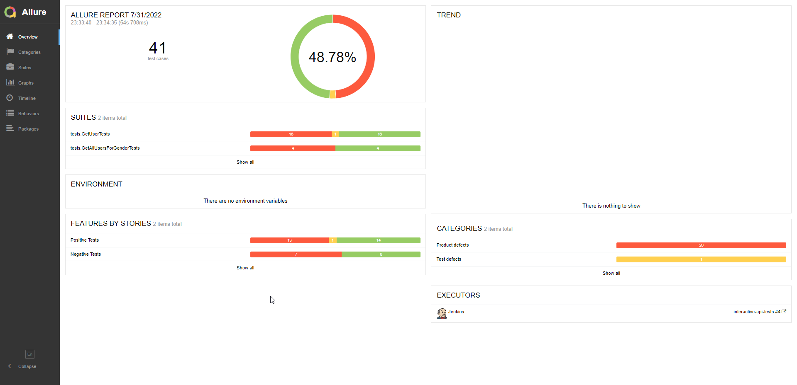
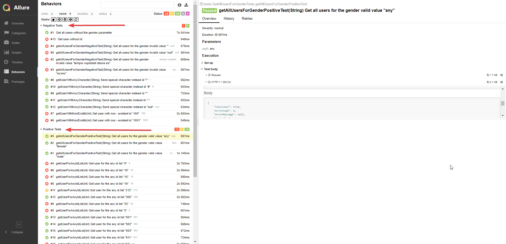
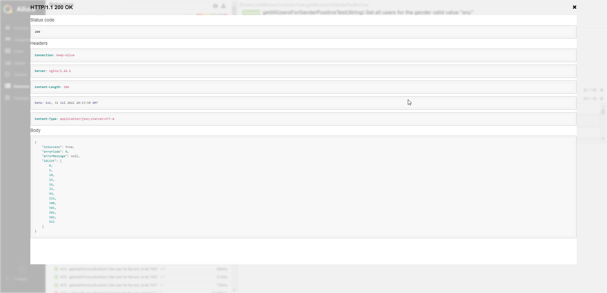
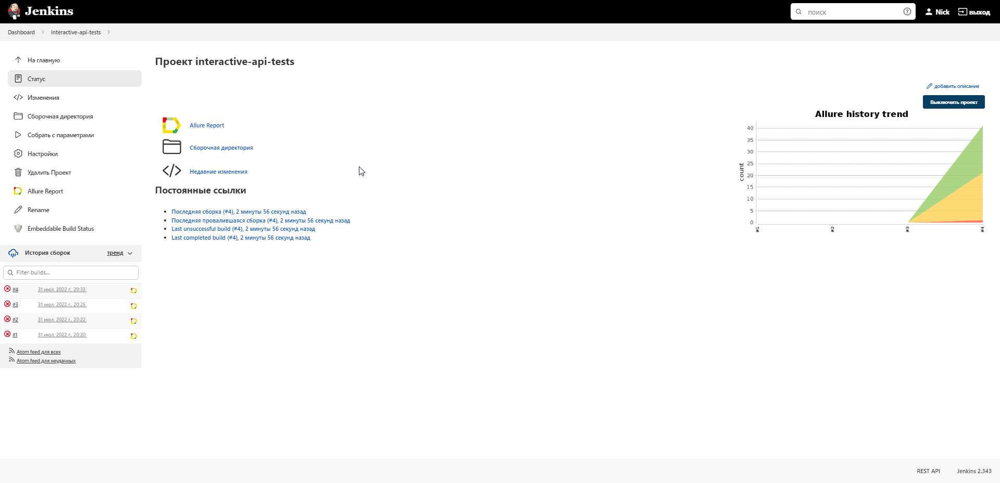
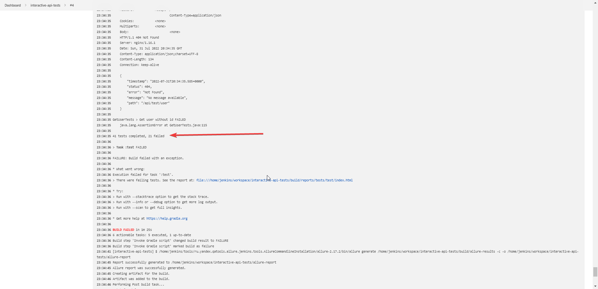

<h1 align="center">Interactive API Test Framework</h1>

<p align="center">
  Automated REST API test suite for the <b>Interactive HR&#8209;Challenge</b> service —
  built on a modern JVM stack with rich Allure reporting and Telegram notifications.
</p>

<p align="center">
  
  
  
  
  
  
</p>

---

## Overview

End-to-end API tests against the Interactive HR&#8209;Challenge REST service. Every test
logs the full request/response, validates the body against a **JSON Schema**, and publishes
a self&#8209;documenting **Allure** report. Results can be pushed straight to **Telegram**.

- **40+** parametrized positive & negative tests
- **JSON Schema** validation on every response
- **Custom Allure templates** rendering request/response as readable cards + cURL
- **Parallel** execution via JUnit 5 Platform engine
- **Telegram** report delivery out of the box

## Tech Stack

| | Tool | Role |
|---|---|---|
|  | **Java 25** | Language / toolchain |
|  | **Gradle 9.5.1** | Build & dependency management |
|  | **JUnit 6** | Test engine, parametrized tests |
|  | **REST&#8209;Assured 6** | HTTP client + response validation |
|  | **Allure 2.35** | Reporting |
|  | **Swagger** | API self-documentation |
|  | **Telegram** | Notifications |
|  | **Jenkins** | CI |

Also: AssertJ (fluent assertions), Jackson (DTO mapping), SLF4J.

## Project Structure

```
src/test/
├── java/
│   ├── tests/        # TestBase (shared specs) + GetUser / GetAllUsers test classes
│   ├── models/       # response DTOs (GetUserResponse, GetUserListResponse, CommonResponseError)
│   └── listeners/    # CustomAllureListener — request/response Allure templates
└── resources/
    ├── schemas/      # JSON Schema (schemaV3.json) for response validation
    └── tpl/          # Freemarker templates for Allure cards
notifications/        # Allure → Telegram delivery (jar + config)
```

## Test Coverage

| Endpoint | Cases |
|---|---|
| `GET /api/test/user/{id}` | valid male/female/any IDs, missing ID, non-existent ID, special characters |
| `GET /api/test/users?gender=` | valid genders, invalid gender, missing parameter |

## Running the Tests

```bash
./gradlew clean test                          # run the whole suite
./gradlew test --tests "tests.GetUserTests"   # run one test class
./gradlew clean test -Dthreads=4              # parallel run (N threads)
```

> Requires **JDK 25** on the machine. The Gradle wrapper pins Gradle **9.5.1** automatically.

## Allure Reporting

Generate and open the report after a run:

```bash
./gradlew allureServe
```

Or launch it from the IDE:



**Overview & behaviors**




**Custom request/response template**



## Telegram Notifications

Allure results can be delivered to a Telegram chat via
[allure-notifications](https://github.com/qa-guru/allure-notifications):

```bash
java -jar notifications/allure-notifications-4.2.1.jar -c notifications/telegram_config.json
```

Set your bot **token** and **chat id** in `notifications/telegram_config.json`.
> Keep real credentials out of version control.

## API Documentation

Swagger UI: [hr-challenge.interactivestandard.com](https://hr-challenge.interactivestandard.com/v3/swagger-ui/index.html?configUrl=%2Fv3%2Fapi-docs%2Fswagger-config&urls.primaryName=QA#/qa-test-controller)

## CI

Jenkins: [build](https://jenkins.autotests.cloud/job/interactive-api-tests/4/) · [allure report](https://jenkins.autotests.cloud/job/interactive-api-tests/4/allure/)



